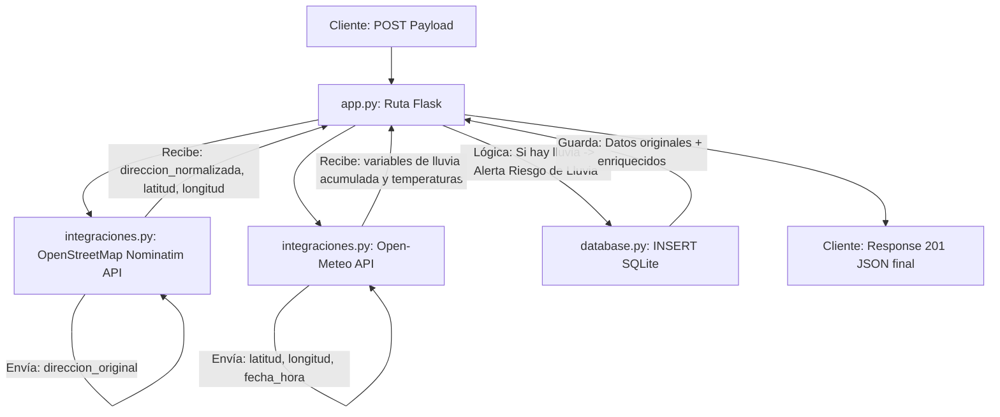

# Documentación del Proyecto: Gestor de Curaduría Cultural

Este documento unifica la especificación técnica, la arquitectura de software, el modelado de datos, las integraciones con APIs externas y el diseño de interfaz (UI/UX) para el desarrollo de la aplicación de curaduría de nicho.

---

## 1. Stack Tecnológico

La aplicación se diseñará bajo un enfoque minimalista, buscando el máximo rendimiento y el menor número de dependencias de terceros para evitar sobrecarga en el entorno de ejecución.

- **Frontend:** Vanilla Web (HTML5 semántico, CSS3 nativo utilizando Flexbox y JavaScript ES6 puro sin frameworks ni librerías).
- **Backend:** Python 3 utilizando Flask como microframework para la gestión de enrutamiento y control de recursos HTTP.
- **Base de Datos:** SQLite a través del módulo nativo `sqlite3` de Python, garantizando persistencia estructurada y local sin dependencias de infraestructura pesada.

---

## 2. Estructura de Directorios del Proyecto

El proyecto se organizará bajo la estructura estándar de una aplicación Flask de una sola página (SPA):

```text
proyecto-curaduria/
│
├── app.py                  # Punto de entrada de Flask, configuración y rutas de la API
├── database.py             # Capa de abstracción para la conexión y consultas a SQLite
├── integraciones.py        # Clientes HTTP para APIs externas (Geocodificación y Open-Meteo)
├── schema.sql              # Script DDL de inicialización de la base de datos
├── design.md               # Especificación de UI/UX (integrada en esta documentación)
│
├── static/                 # Recursos estáticos servidos por el servidor Flask
│   ├── css/
│   │   └── styles.css      # Hoja de estilos nativa con diseño Flexbox y paleta otoñal
│   └── js/
│       └── app.js          # Control de eventos, llamadas HTTP (Fetch) y actualización optimista
│
└── templates/
    └── index.html          # Interfaz de usuario (Estructura semántica de la pantalla partida)
```

---

## 3. Modelo de Datos y Persistencia (SQLite)

La persistencia se resolverá con una base de datos SQLite de un único archivo local. La tabla principal almacenará tanto los metadatos ingresados por el organizador como los datos enriquecidos mediante servicios externos.

### DDL de Inicialización (`schema.sql`)

```sql
CREATE TABLE IF NOT EXISTS eventos (
    id INTEGER PRIMARY KEY AUTOINCREMENT,
    titulo TEXT NOT NULL,
    disciplina TEXT NOT NULL,          -- Ej: 'Fotografía', 'Feria de Diseño', 'Literatura'
    fecha_hora TEXT NOT NULL,          -- Formato ISO 8601: YYYY-MM-DDTHH:MM
    direccion_original TEXT NOT NULL,  -- Lo que ingresa el organizador manualmente
    direccion_normalizada TEXT,        -- Devuelto por el servicio de geocodificación
    latitud REAL,                      -- Coordenada para consultas de clima y mapas
    longitud REAL,                     -- Coordenada para consultas de clima y mapas
    alerta_clima TEXT,                 -- Advertencia generada por el backend (Ej: "Lluvia detectada")
    estado TEXT DEFAULT 'Borrador'     -- Estados permitidos: 'Borrador' o 'Publicado'
);
```

---

## 4. Arquitectura de Endpoints y Flujo de Integración

El servidor Flask expondrá una API REST minimalista que intercambiará payloads exclusivamente en formato JSON.

### Endpoints del Sistema

#### `GET /`
- **Descripción:** Retorna la plantilla principal de la interfaz (`templates/index.html`).

#### `GET /api/eventos`
- **Descripción:** Recupera la colección completa de eventos guardados.
- **Respuesta (JSON):** Array de objetos de eventos con sus columnas correspondientes.

#### `POST /api/eventos`
- **Descripción:** Recibe el formulario de alta de un nuevo evento, ejecuta las integraciones de datos en segundo plano y persiste el registro enriquecido.
- **Payload (JSON):**
  ```json
  {
    "titulo": "Feria del Libro Independiente",
    "disciplina": "Literatura",
    "fecha_hora": "2026-10-15T16:00",
    "direccion_original": "Defensa 1100, San Telmo"
  }
  ```
- **Respuesta Exitosa (201 Created - JSON):** Retorna el objeto completo con su ID de base de datos asignado y el enriquecimiento climático/geográfico.

---

### Ciclo de Vida del `POST /api/eventos` (Procesamiento del Servidor)

Al recibir una petición de inserción, el módulo `app.py` orquestará secuencialmente el procesamiento a través de los demás componentes:



1. **Nominatim API (OpenStreetMap):**
   - **Envía:** `direccion_original`
   - **Recibe:** `direccion_normalizada`, `latitud`, `longitud`
2. **Open-Meteo API:**
   - **Envía:** `latitud`, `longitud`, `fecha_hora`
   - **Recibe:** Pronóstico de lluvia y temperaturas.
   - **Lógica:** Si se detecta pronóstico de lluvia, se asigna la alerta *"Riesgo de Lluvia"*.
3. **Persistencia:**
   - Guarda el registro enriquecido en SQLite mediante `database.py`.

---

## 5. Especificación de Diseño de Interfaz (UI/UX)

La UI se estructurará bajo un concepto minimalista de pantalla partida para una experiencia ágil de escritorio, con una estética basada en colores de la naturaleza otoñal.

### A. Estructura del Layout (`index.html`)

La pantalla se divide en un contenedor maestro sin scrolls globales (**100vh de altura estricta**).

- **Panel Izquierdo (35% de ancho, Fijo):**
  - Fondo estructurado con tono arena suave (`--bg-panel`).
  - Formulario vertical autocontenido con los campos:
    - Título (Input texto).
    - Disciplina (Selector nativo).
    - Fecha y Hora (Input `datetime-local`).
    - Dirección (Input texto).
  - Un botón sólido en color terracota (`--color-accent`) centrado y destacado.
- **Panel Derecho (65% de ancho, Scrollable):**
  - Fondo general claro (`--bg-main`).
  - Contenedor Flexbox dinámico con espaciados calculados nativamente (`gap`).
  - Visualiza las tarjetas de los eventos cargados en el sistema de manera compacta.

---

### B. Sistema de Estilos y Variables CSS (`static/css/styles.css`)

El diseño utiliza variables CSS integradas en el selector `:root` para asegurar consistencia cromática:

```css
:root {
    /* Paleta Neutra y Fondos */
    --bg-main: #F9F6F0;          /* Blanco lino, fondo del panel de tarjetas */
    --bg-panel: #F0EAE1;         /* Arena suave, fondo del formulario lateral */
    --text-main: #2C2520;        /* Café oscuro profundo para textos principales */
    --text-muted: #706253;       /* Tierra apagado para metadata y subtítulos */

    /* Colores Otoñales de Acento y Estados */
    --color-accent: #C05C33;     /* Terracota / Óxido para botones e interacciones */
    --color-draft: #D4A373;      /* Ocre / Hojas secas para estado 'Borrador' */
    --color-published: #606C38;  /* Verde musgo / Seco para estado 'Publicado' */
    
    /* Contenedores Destacados (Integraciones) */
    --bg-alert-weather: #E6CCB2; /* Beige cálido para alertas meteorológicas estándar */
    --bg-alert-crit: #DDB892;    /* Tono arcilla para alertas de riesgo climático (Lluvia) */
    --border-radius: 6px;        /* Bordes redondeados sutiles */
}
```

#### Estructura de Tarjetas (`.event-card`)
Las tarjetas usan Flexbox para acomodarse y tienen un ancho flexible de base:
```css
.event-card {
    flex: 1 1 280px;
    background-color: #ffffff; /* Blanco puro */
    /* Sombra sutil o caja plana sin bordes pesados */
}
```
- **Cabecera:** Título en tipografía prominente (`--text-main`) y un badge compacto en la esquina superior derecha que cambia dinámicamente según el estado (`Borrador` en ocre o `Publicado` en verde musgo).
- **Cuerpo:** Bloque de información que indica la disciplina, la fecha/hora formateada y la dirección original en tono tierra apagado (`--text-muted`).
- **Pie de Tarjeta (Contenedor Destacado):** Bloque con fondo diferenciado (`--bg-alert-weather`) que aloja la dirección geocodificada devuelta por el servidor y el icono/texto del estado climático de Open-Meteo. Si el evento contiene una alerta de lluvia, este contenedor transmuta su color a `--bg-alert-crit` de forma reactiva.

---

## 6. Comportamiento del Frontend y Flujo Optimista (`static/js/app.js`)

El comportamiento interactivo se basará en actualizaciones del DOM de forma optimista para garantizar un flujo de trabajo fluido para el organizador de eventos.

### Algoritmo de Flujo del Formulario:

1. **Captura del Evento `submit`:**
   - Se previene el comportamiento de recarga nativo mediante `event.preventDefault()`.
   - Se extraen los datos de los inputs del formulario.
2. **Deshabilitación Visual:**
   - Se deshabilitan los inputs y el botón principal del formulario para evitar que el usuario envíe peticiones duplicadas antes de tiempo.
3. **Inserción de Tarjeta Temporal (Optimista):**
   - Se crea un nodo de tarjeta dinámico clonando una plantilla base o creando elementos HTML mediante JavaScript.
   - Se renderiza con los datos del formulario ingresados por el usuario.
   - La tarjeta se inserta inmediatamente al principio de la grilla Flexbox en el panel derecho.
   - Se aplica una opacidad reducida (`opacity: 0.6`) y se muestra un loader o un texto indicativo en el pie de la tarjeta: *"Procesando curaduría e integraciones..."*.
4. **Ejecución de Petición HTTP (`fetch`):**
   - Se envía un POST al endpoint `/api/eventos` transportando los datos en el cuerpo de la petición como JSON.
5. **Procesamiento de la Respuesta:**
   - **Si el Servidor Responde Exitosamente (Código 201):**
     - Se lee el JSON devuelto (que ya contiene el ID persistido, la dirección normalizada exacta de Nominatim y el diagnóstico del clima de Open-Meteo).
     - La tarjeta optimista recupera su opacidad al 100%.
     - Se quita el texto temporal del contenedor destacado y se inyectan las respuestas reales del backend (dirección normalizada y alerta climática activa, aplicando el color `--bg-alert-crit` si es pertinente).
     - El formulario izquierdo se desbloquea y se limpian sus campos.
   - **Si la Petición Falla:**
     - La tarjeta temporal se remueve del DOM aplicando un sutil efecto de transición visual.
     - El formulario izquierdo vuelve a habilitarse y se despliega un contenedor de error temporal en el panel de carga para advertir al organizador que el evento no pudo procesarse correctamente.